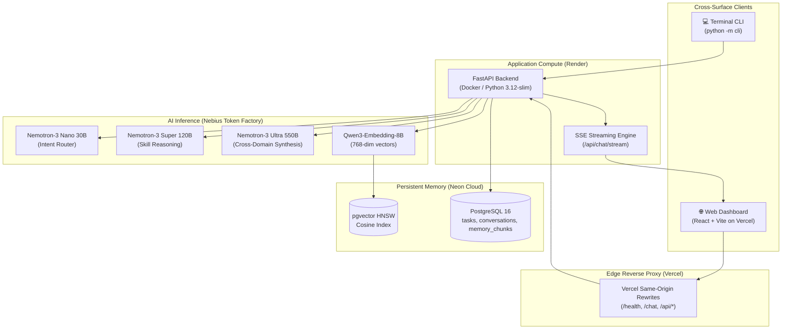

# Compass — Architecture Deep Dive

## System Overview

Compass separates client delivery, application compute, AI inference, and persistent storage into decoupled cloud layers.



## Request Flow

1. **User sends a message** via web UI or CLI
2. **Nemotron-3 Nano (30B)** routes the intent — selects a tool call or returns direct chat (measured at sub-400ms on Nebius Token Factory)
3. **Skill handlers** execute: SQL queries, vector searches, calendar operations, Tavily web calls
4. **Nemotron-3 Super (120B)** performs multi-step reasoning for complex queries
5. **Nemotron-3 Ultra (550B)** synthesizes cross-domain roadmaps (invoked only for `summarize_across_domains`)
6. **SSE stream** delivers token-by-token output to the web UI

## Northstar + Specialist Architecture

```
                    COMPASS
                       │
          ┌────────────┴────────────┐
          │                         │
     🧭 NORTHSTAR             🧠 SPECIALIST TEAM
     (Chat + Agent)           (Domain Experts)
          │                         │
     ┌────┴────┐            ┌───────┼───────┐
     │         │            │       │       │
    Chat    ReAct        Coursework Research Calendar Memory
                Agent
                │
                │ delegate when needed
                ▼
          Specialist Team
                │
                ▼
           Results
                │
                ▼
    Confirmation → Execution → Audit → Undo
```

**Northstar** is the primary user-facing AI workspace combining Chat Copilot and Goal Planner. It handles all conversational queries and can initiate multi-step autonomous planning.

**Specialist Team** consists of four domain-focused agents (`coursework`, `research`, `calendar`, `memory`) that are delegated to by Northstar when narrow domain expertise is needed. Specialists return **proposed actions** — they never mutate the database directly. All proposed mutations require Northstar's confirmation gate before execution.

## Memory Architecture

### Structured Memory (PostgreSQL)

Core tables (auto-migrated on startup via `backend/memory/db.py`):

| Table | Purpose |
|-------|---------|
| `tasks` | Task/deadline store with domain, priority, status, due_date |
| `projects` | Normalized project registry (FK target for tasks and chunks) |
| `conversations` | Chat session metadata (pinned, archived, named) |
| `messages` | Per-conversation message history |
| `memory_chunks` | Vector-indexed semantic memory (768-dim embeddings) |
| `agent_runs` | Autonomous agent execution history |
| `agent_audit_log` | Mutation audit trail with 1-click undo |
| `calendar_connections` | Encrypted Google OAuth tokens |
| `calendar_event_links` | Task ↔ Google Calendar event mapping |
| `tavily_usage_log` | Web search credit tracking |
| `task_schedule_slots` | Calendar slot allocations |
| `task_dependencies` | Task dependency graph |

### Vector Memory (pgvector)

Code context, coursework notes, and ingested web documents are embedded via `Qwen/Qwen3-Embedding-8B` into 768-dimensional vectors (Matryoshka-truncated from 4,096 native dimensions to fit pgvector's 2,000-dim HNSW ceiling).

Similarity search uses HNSW cosine indexing (`<->`), enabling sub-5ms retrieval on warm queries (observed during internal testing on Neon Cloud).

## Deployment

### Current Production State

| Component | Host | URL |
|-----------|------|-----|
| Frontend | Vercel | https://compass-farmlytics.vercel.app |
| Backend API | Render | https://compass-backend-qryu.onrender.com |
| Database | Neon Cloud | Serverless PostgreSQL + pgvector |
| AI Inference | Nebius Token Factory | All model calls |

### Nebius AI Cloud (Manifests Ready)

Deployment manifests exist in `deploy/`:
- `deploy/serverless_endpoint.yaml` — container endpoint for FastAPI
- `deploy/serverless_job.yaml` — nightly memory consolidation cron job

These manifests provide turnkey deployment to Nebius AI Cloud. Current compute runs on Render; migration to Nebius Cloud compute requires tenant billing activation.

### Docker Compose (Local Full Stack)

```bash
docker compose up
```

Starts pgvector-enabled PostgreSQL 16 (port 5432), FastAPI (port 8000), and Nginx frontend (port 5173).

## Security Notes

**Public endpoints** (rate-limited via per-IP sliding window):
- `POST /api/chat` — 30 req/min
- `POST /api/chat/stream` — 30 req/min
- `POST /api/agent/run` — 10 req/min

These are intentionally public to allow judge/evaluator access without pre-configured credentials.

**Protected endpoints** (require `AUTH_TOKEN` Bearer header):
- `POST /api/agent/confirm` — execute approved mutations
- `POST /api/agent/undo` — reverse mutations
- `POST /api/agent/trigger-nightly` — run consolidation job

**Important note**: `POST /api/chat` allows task creation without authentication — direct chat commands like `"add a task: ..."` persist to the database unauthenticated. This is an explicit design decision for demo accessibility; a future security hardening pass will add authenticated user namespacing.

All users in anonymous/demo mode receive isolated workspaces (`anon_...` prefix) to prevent cross-user data leakage.
